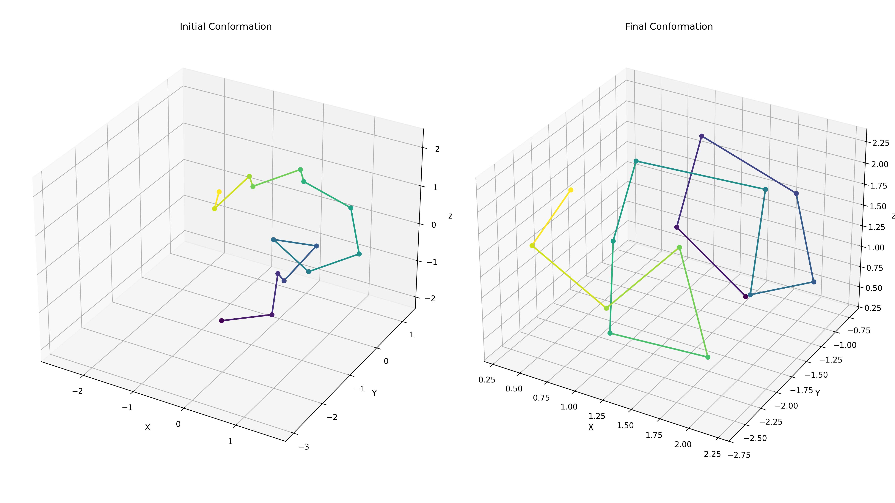
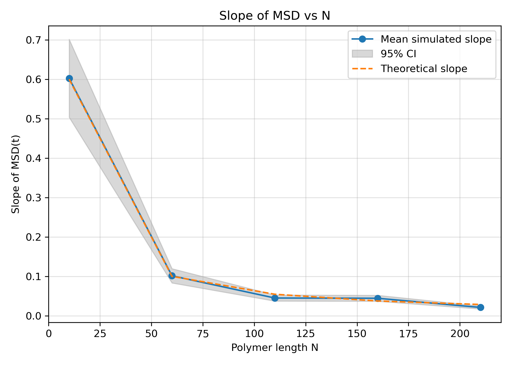
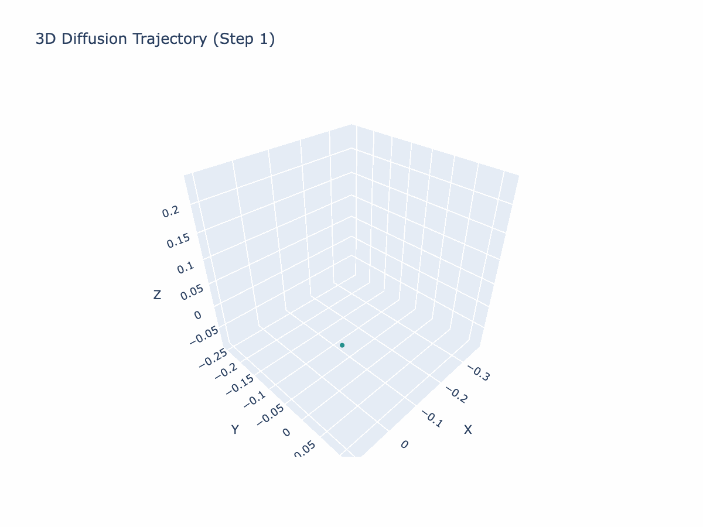

# Stochastic Simulation — Assignments

Three course assignments, each looking at stochastic simulation from a different angle: Monte Carlo integration, discrete-event queueing, and Langevin / MCMC polymer dynamics.

| # | Topic | Methods | Entry point |
|---|-------|---------|-------------|
| 1 | **Monte Carlo volume estimation** of tori and sphere intersections | Hit-or-miss MC, uniform vs. deterministic sampling, mixed sampling, variance analysis | `assignment_1/deliverables/Code_Hypercube_Hypers.py` |
| 2 | **Airport security queue** (M/G/c) | SimPy discrete-event simulation, warm-up detection, service-time sweeps, hypothesis tests | `assignment_2/main.py` |
| 3 | **Bead-spring polymer dynamics** | Harmonic + Lennard-Jones forces, overdamped Langevin, MALA, simulated annealing, MSD / end-to-end scaling | `assignment_3/polymer_engine.py` |

## Setup

Python 3.12.

```bash
python -m venv .venv && source .venv/bin/activate
pip install -r requirements.txt simpy plotly
```

## Run

From the repository root:

```bash
python assignment_1/deliverables/Code_Hypercube_Hypers.py   # MC volume estimates + plots
python assignment_2/main.py                                  # queue simulations → assignment_2/img/
python assignment_3/polymer_engine.py                        # polymer runs → assignment_3/img/, *.csv
```

## Assignment 3 highlights

- **Physics:** harmonic bonds and Lennard-Jones non-bonded interactions, with Numba-JIT kernels.
- **Samplers:** Euler–Maruyama Langevin dynamics and Metropolis-adjusted Langevin (MALA). Simulated annealing is used to search for low-energy conformations.
- **Validation:** checks free diffusion against $\langle r^2\rangle = 6Dt$, the bond-length distribution, and the end-to-end scaling $\langle R_{ee}^2\rangle \propto N^{2\nu}$ for ideal and LJ chains.
- **Extras:** `markov.py` (a small Markov chain) and `annealing.py` (SA on the Rastrigin function) are warm-up scripts.

<p align="center">
  
  
</p>

### Interactive plots

<p align="center">
  <a href="https://htmlpreview.github.io/?https://github.com/lorenzotecchia/StochasticSimulation/blob/main/assignment_3/diffusion_animation.html">
    
  </a>
</p>

- [3D diffusion trajectory — animated](https://htmlpreview.github.io/?https://github.com/lorenzotecchia/StochasticSimulation/blob/main/assignment_3/diffusion_animation.html)
- [3D diffusion trajectory — static](https://htmlpreview.github.io/?https://github.com/lorenzotecchia/StochasticSimulation/blob/main/assignment_3/img/diffusion_plot.html)

## Layout

```
assignment_1/   Monte Carlo integration   (deliverables/ holds code, report table, contribution sheet)
assignment_2/   SimPy airport queue       (airport.csv input, data/ cached sweeps, img/ figures)
assignment_3/   polymer simulation        (img/ figures, *_results_*.csv fitted slopes / R_ee²)
```
